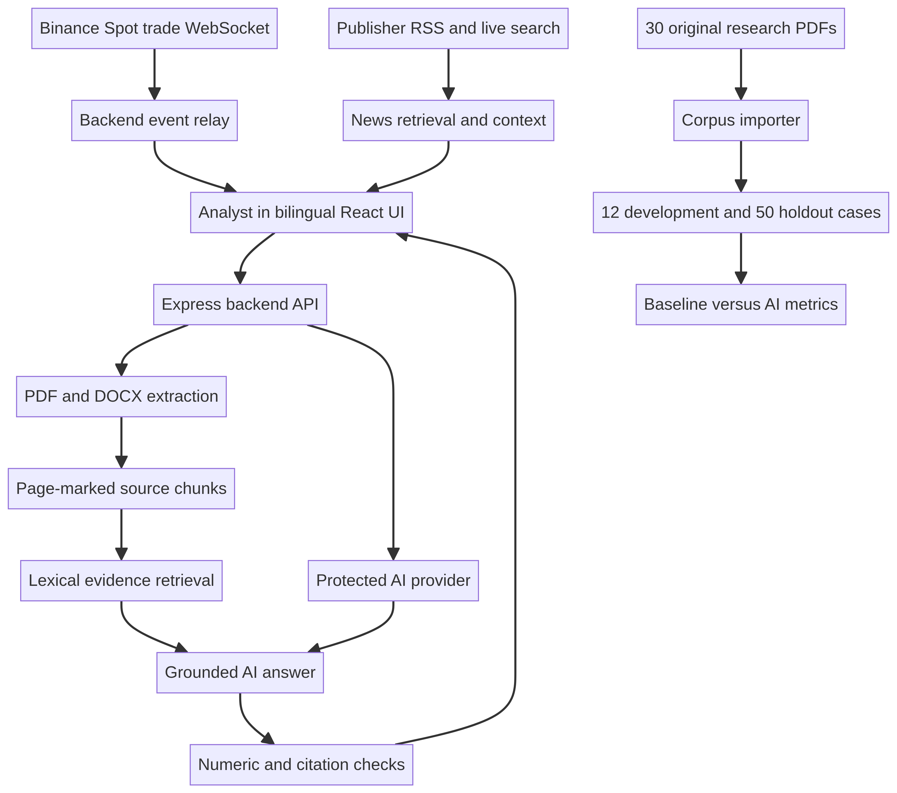

# Product documentation

Product name: LumenArc Crypto Intelligence

Version: course prototype, October 2026

## Persona and job to be done

A research analyst covering digital assets receives many long PDF reports with market commentary, stated numerical levels, and sector sentiment. Under time pressure, the analyst must locate what a particular source actually says, attach the passage and page, and refuse to claim a resistance level when that report does not give one. The product makes source review faster to navigate without making an unsupported time-savings claim.

This is a research assistant and context dashboard, not a trading terminal. Its primary task is document-grounded retrieval and extraction. Market prices and news are additional situational context and are not substituted for statements in a research PDF.

## Main user journey

1. Add an original text-based PDF, DOCX, TXT, or Markdown source. The application parses the file on the backend and stores page-marked chunks for this temporary workspace.
2. Ask a precise question such as "In the February 2026 report, what level did BTC reach in January?" The lexical baseline can be run separately.
3. Review a categorical evidence state, an answer or an explicit non-answer, source title, PDF page, passage, and original URL when supplied.
4. Generate a report brief only from the uploaded passages.
5. Monitor ten Binance Spot USDT pairs through pushed WebSocket trade events. Check the connection and last exchange event timestamps before treating a displayed price as fresh.
6. Search current crypto news, open a third-party publisher story, and optionally classify its headline and RSS excerpt with AI. The application does not claim to have read inaccessible article bodies.
7. Switch the interface between English and Simplified Chinese without silently changing the original source text.

## Input, transformation, and output

| Module | Input | Processing | Output |
| --- | --- | --- | --- |
| Document ingestion | File up to 18 MB | Validate format, parse real bytes, keep PDF page boundaries, create overlapping chunks | Document metadata and searchable page passages |
| Question answer | User question and selected source documents | Report-month selection when explicit, lexical passage ranking, constrained model response, citation and number checks | Evidence status, answer, page citations, or "I don't know" |
| Keyword baseline | Same question and documents | Deterministic lexical ranking and excerpt selection, with no model | Raw matching source sentence and page |
| Research brief | Indexed document passages | AI synthesis constrained to provided source text, then numeric and citation checks | Brief, evidence state, page citations, caveats |
| Market stream | Binance Spot trades and 24-hour ticker events for ten USDT pairs | Backend WebSocket connection, bounded server-sent relay, reconnection and per-asset freshness check | Event-driven USDT price, 24-hour change when supplied, timestamp and connection state |
| AI market pulse | Ten fresh observed exchange quotes | The existing grounded answer module receives one timestamped source passage and is checked for citations | On-demand qualitative comparison, not a forecast or continuous commentary |
| News discovery | Three publisher RSS feeds and on-demand Google News RSS query | Retrieve recent articles, deduplicate, refresh on a bounded timer | Headline, publisher, excerpt, publication and retrieval times, external link |
| News AI context | Selected feed headline and excerpt | Backend-only model classification | Positive, Negative, Mixed, or Unclear and Broad market or Coin specific with rationale |

The evidence state is not a calibrated probability. Supported means a cited passage passes the implemented checks. Insufficient evidence means no defensible answer was found or verification failed. Conflicting evidence means supplied sources materially disagree. Needs clarification means the question cannot be interpreted reliably. A supported state still requires analyst review, particularly when PDF layouts or tables were flattened.

## Architecture and ownership

The React client owns layout, navigation, language switching, and user interactions. The Node and Express backend owns file parsing, lexical retrieval, all provider requests, and the Binance WebSocket. The model and external data services are rented. Source extraction, evidence rules, UI logic, and evaluation scripts are built here. The school OpenRouter key belongs only in a protected server environment secret. The configured Preview currently uses the project AI fallback because the protected OpenRouter input was not confirmed. The provider field in the application reports the actual route.

The server does not persist documents to a database. A browser-local workspace identifier partitions a temporary in-memory document set but is not authentication. Files vanish when the process restarts or after two hours of workspace inactivity. The prototype limits active workspaces, aggregate stored text, document count, and AI calls per workspace hour to reduce accidental resource exhaustion. These limits are not authentication or a dollar-spend guarantee. For AI answers and briefs, selected source excerpts are sent to the configured external model provider, even though complete uploaded files stay in server memory. Do not use this prototype to store confidential or regulated records. The absence of account-level access control makes public production publication inappropriate without authentication and durable storage.

## Real data sources and provenance

Thirty original English Binance Research monthly reports were downloaded, signature-checked, counted with a PDF parser, and text-extracted. The fixed list in `../data/manifest.csv` spans March 2024 through September 2026, excluding December 2024 to make a declared 30-report selection. The evaluation parser separately processed all 30 original PDFs into 559 PDF pages and 1,017 searchable passages in its first development run. Public source URLs, SHA256 checksums, titles, and page counts remain available in the manifest. Original PDFs and complete extracts are excluded from the Git repository because redistribution rights are not established. The importer reproducibly retrieves them from their public source URLs.

Binance Spot market-data WebSocket is the working market source. The backend receives each trade in real time, publishes the latest observed quote at most four times per second per asset, and pairs it with an exchange 24-hour ticker update. Neither the code nor the interface fabricates a price movement for an inactive asset. Prices are USDT-denominated and must not be misrepresented as exact fiat USD quotes. A separate AI market pulse uses only a captured observation of all ten fresh pairs and carries its own source excerpt and observation time. It does not update automatically or forecast prices. Coinbase's public WebSocket could not pass TLS certificate validation in this environment, so the implementation switched to the publicly documented Binance market-only endpoint rather than disabling TLS verification. News retrieval depends on third-party RSS feeds. Publisher-native entries have direct publisher article URLs. On-demand Google News searches can return a Google News forwarding URL and can omit full article text. The UI distinguishes the feed excerpt from an unseen article.

## Evaluation contract

The primary outcome is source-supported numeric extraction on answerable questions, compared with the keyword baseline. Ten no-answer cases measure safe refusal. Both correct abstention and wrongful abstention must be shown so an always-refusing system cannot appear successful. In addition, the runner checks whether the cited source passage from the named original report contains the expected number. A quotation on another valid page of the same report is acceptable.

The 12 development questions are confined to reports from March through August 2024. The 50-case holdout uses later reports, with 40 numeric cases and 10 unanswerable cases. Both split files are checksummed. Retrieval configuration is selected using only development cases, then frozen before the holdout run. See `../eval/README.md` and the preserved machine-readable run summaries for achieved figures. Source-quote validation is automated, and the student should independently inspect labels before presenting them as human verified.

## Risks and explicit exclusions

- A PDF can have image-only pages or distorted table text. The prototype rejects files without usable text and does not claim OCR coverage.
- A passage can mention a number without establishing the requested relationship. The numeric check is a guardrail, not a proof of semantic correctness.
- Out-of-context or inconsistent report statements can produce a conflict state or an overcautious refusal. Development and holdout results expose both errors.
- A server restart erases document state and resets the in-process AI request count. A public deployment needs durable storage, authentication, and persistent quota enforcement.
- A publisher feed can go offline or omit the full article. The app shows retrieval failure rather than fabricated news.
- A lost exchange connection must be shown as reconnecting or stale. No one-minute polling snapshot is represented as a continuous market stream.
- No transaction execution, autonomous trading advice, portfolio suitability assessment, or speed-saving percentage is claimed.

## Technical trade-off

Streamlit was initially attractive for a quick first version. React and Node required more implementation effort but permitted a clearer backend-only secret boundary, explicit document workspace state, a reliable server-owned WebSocket relay with connection status, and a more mature animated bilingual interface. This change was deliberate and does not imply that the faster alternative was technically wrong. It makes the operational and communication requirements easier to meet at the cost of greater frontend and deployment complexity.
